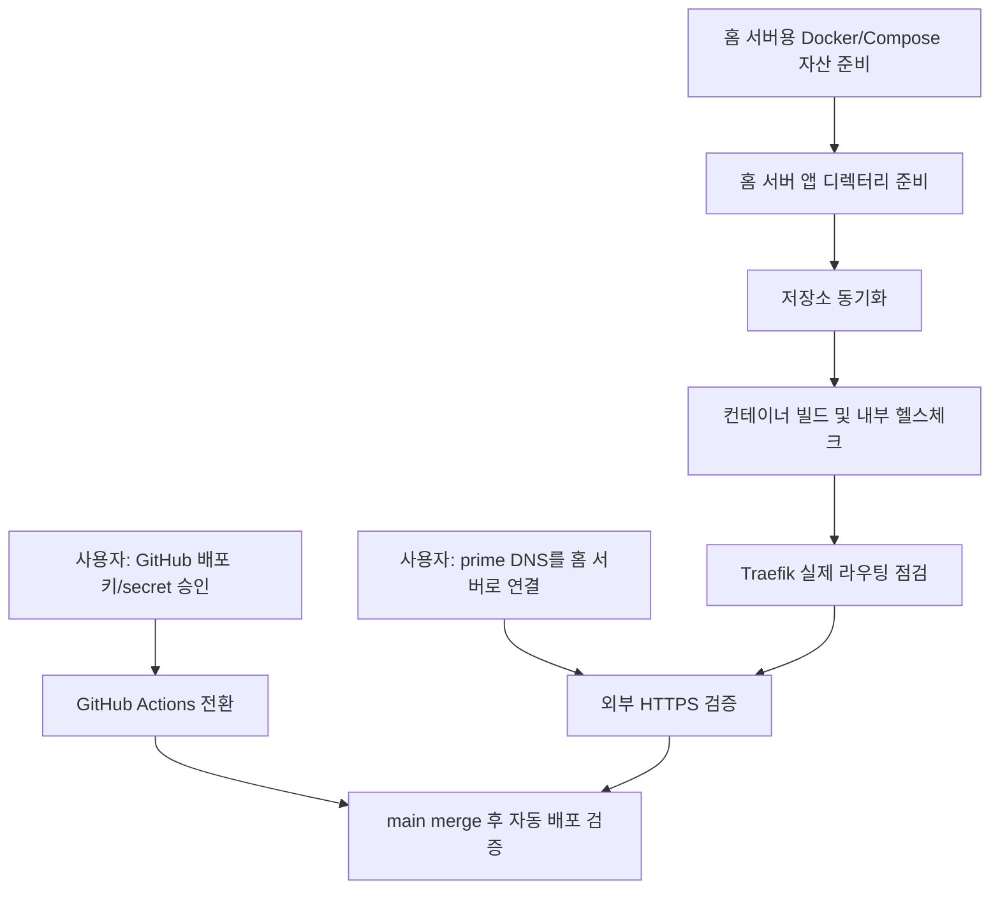

# FactorRush 홈 서버 전환 가이드

이 문서는 현재 `Oracle + systemd + nginx` 기준으로 잡혀 있던 배포 경로를, 이미 `Docker + Traefik + Cloudflare DNS challenge`가 운영 중인 홈 서버로 옮기는 작업을 정리한다.

현재 홈 서버의 장점:

- `80/443`을 이미 Traefik이 받고 있다.
- Let's Encrypt 발급이 Cloudflare DNS challenge로 이미 자동화되어 있다.
- `proxy` Docker network가 이미 존재한다.
- `whoami.0x51018.com` 같은 기존 서비스가 같은 패턴으로 서빙되고 있다.
- 배포 계정이 Docker를 직접 사용할 수 있어서 `sudo + systemd`보다 운영 경로가 단순하다.

## 권장 런타임 구조

```text
사용자 브라우저
  -> https://prime.0x51018.com
  -> Traefik
     -> Host(prime.0x51018.com)                     -> factorrush-web (3000)
     -> Host(prime.0x51018.com) + PathPrefix(/socket.io) -> factorrush-server (3001)
```

핵심은 웹과 실시간 서버를 둘 다 Docker 컨테이너로 띄우고, Traefik이 같은 도메인 아래에서 경로 기준으로 나눠 주는 것이다.

## 저장소에 추가된 홈 서버 배포 자산

- Dockerfile: `deploy/home/Dockerfile`
- Compose 파일: `deploy/home/docker-compose.yml`
- Compose 변수 예시: `deploy/home/.env.example`
- 컨테이너 env 예시:
  - `deploy/home/web.env.example`
  - `deploy/home/server.env.example`
- 홈 서버 배포 스크립트: `scripts/deploy-home.sh`

## 전체 작업 목록

### 내가 할 수 있는 것

- 홈 서버용 Docker 빌드/런타임 자산 준비
- Compose와 Traefik 라우팅 규칙 준비
- 배포 스크립트 준비
- 홈 서버 앱 디렉터리 생성
- 저장소 동기화
- 컨테이너 빌드/기동
- 내부 헬스체크
- GitHub Actions 전환용 워크플로 수정

### 사용자가 꼭 해야 하는 것

- `prime.0x51018.com`을 실제로 홈 서버 공개 IP로 돌릴지 최종 결정
- Cloudflare DNS에서 `prime.0x51018.com` 레코드를 홈 서버 쪽으로 연결
- GitHub `production` 환경 변수/secret를 홈 서버 기준으로 갱신
- 홈 서버에 GitHub Actions용 배포 키를 허용할지 승인

## 의존성 그래프



## 1. 홈 서버 디렉터리 구조

권장 위치:

```text
/home/younhj1018/apps/factorrush/
  app/                # Git checkout
```

## 2. 최초 설정 파일 준비

아래 예시 파일을 실제 파일로 복사해서 값만 채운다.

```bash
cp deploy/home/.env.example deploy/home/.env
cp deploy/home/web.env.example deploy/home/web.env
cp deploy/home/server.env.example deploy/home/server.env
```

기본값 예시:

### `deploy/home/.env`

```env
COMPOSE_PROJECT_NAME=factorrush
FACTORRUSH_HOST=prime.0x51018.com
NEXT_PUBLIC_SERVER_URL=https://prime.0x51018.com
```

설명:

- `FACTORRUSH_HOST`는 Traefik 라우터가 매칭할 실제 서비스 호스트명이다.
- `NEXT_PUBLIC_SERVER_URL`은 Next 클라이언트 번들에 빌드 타임으로 주입된다.
- 즉, 홈 서버 방식에서는 `web.env`만으로는 부족하고 `.env`에도 같은 공개 URL이 들어 있어야 한다.

### `deploy/home/web.env`

```env
NODE_ENV=production
HOSTNAME=0.0.0.0
PORT=3000
NEXT_PUBLIC_SERVER_URL=https://prime.0x51018.com
```

### `deploy/home/server.env`

```env
NODE_ENV=production
PORT=3001
ALLOWED_ORIGINS=https://prime.0x51018.com
```

## 3. 수동 기동

```bash
docker compose --env-file deploy/home/.env -f deploy/home/docker-compose.yml up -d --build
```

확인:

```bash
docker compose --env-file deploy/home/.env -f deploy/home/docker-compose.yml ps
docker compose --env-file deploy/home/.env -f deploy/home/docker-compose.yml logs --tail=100
```

## 4. 자동 배포 방향

홈 서버 전환 후에는 GitHub Actions가 SSH로 홈 서버에 접속해 `scripts/deploy-home.sh`를 실행하도록 바꾸는 것이 가장 단순하다.

중요:

- 지금 저장소의 기존 `deploy.yml`은 Oracle 쪽 `systemd` 배포 경로를 기준으로 작성되어 있다.
- 홈 서버 전환 전에는 이 워크플로를 바로 덮지 말고, 먼저 홈 서버 수동 기동과 외부 도메인 검증을 끝내는 편이 안전하다.
- 즉, 순서는 `수동 검증 -> GitHub secret 전환 -> 워크플로 전환`이 맞다.

## 5. 추천 컷오버 순서

1. 홈 서버에 앱 디렉터리와 설정 파일 준비
2. 홈 서버에서 Docker 수동 기동
3. Traefik 내부 라우팅 확인
4. `prime.0x51018.com` DNS를 홈 서버로 전환
5. 외부 HTTPS 실검증
6. GitHub Actions 배포 대상을 홈 서버로 전환
7. `main` 머지 기반 자동 배포 검증
